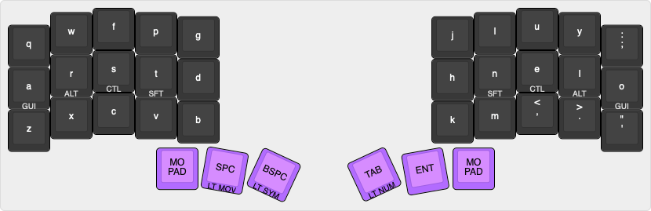

# chdorner36

My Corne crkbd QMK layout with 36 keys and miryoku-esque directives.

## Layout

### Base layer


### Movement layer


### Numpad layer


### Symbol layer


## Prerequisites

```
brew install qmk/qmk/qmk

git clone git@github.com:chdorner/qmk_firmware.git
git clone git@github.com:chdorner/chdorner36.git qmk_firmware/keyboards/crkbd/keymaps/chdorner36

qmk setup
```

## Compile firmware

In `qmk_firmware` root directory:
```
qmk compile -kb crkbd -km chdorner36

# or with QMK user prefs setup:
qmk compile
```

## Flash firmware

To put the keyboard into DFU (Bootloader) mode press the reset button which on Corne PCBs are next to the TRRS jack.

In `qmk_firmware` root directory:
```
qmk flash -kb crkbd -km chdorner36

# or with QMK user prefs set up:
qmk flash
```
