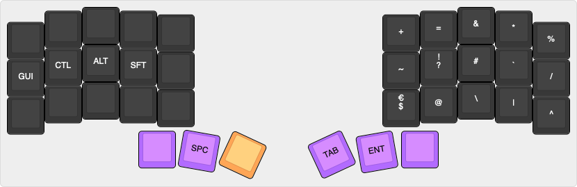

# chdorner36

My Corne crkbd QMK layout with 36 keys and miryoku-esque directives.

## Layout

### Base layer


#### Combos

* right-handed, vertical
  * `(` = `l` + `n` – index finger between home and above row
  * `)` = `u` + `e` – middle finger between home and above row
  * `{` = `n` + `m` – index finger between home and below row
  * `}` = `e` + `,` – middle finger between home and below row
  * `[` = `SFT` + `n` + `m` – ring finger between home and above row
  * `]` = `SFT` + `e` + `,` – pinky finger between home and above row
  * `ESC` = `o` + `'` – pinky finger between home and below row, easily accessible even when hand not on home row
* two-handed
  * `-` = `p` + `l` – both index fingers above home row
  * `_` = `v` + `m` – both index fingers below home row
  * `ESC` = `a` + `o` – both pinky fingers on home row
  * `CAPS WORD` = `z` + `'` – both pinky fingers below home row

### Movement layer


### Symbol layer


### Numpad layer


### Macropad layer


## Prerequisites

```
brew install qmk/qmk/qmk

git clone git@github.com:chdorner/qmk_firmware.git
git clone git@github.com:chdorner/chdorner36.git qmk_firmware/keyboards/crkbd/keymaps/chdorner36

qmk setup
```

## Compile firmware

In `qmk_firmware` root directory:
```
qmk compile -kb crkbd -km chdorner36

# or with QMK user prefs setup:
qmk compile
```

## Flash firmware

To put the keyboard into DFU (Bootloader) mode press the reset button which on Corne PCBs are next to the TRRS jack.

In `qmk_firmware` root directory:
```
qmk flash -kb crkbd -km chdorner36

# or with QMK user prefs set up:
qmk flash
```
